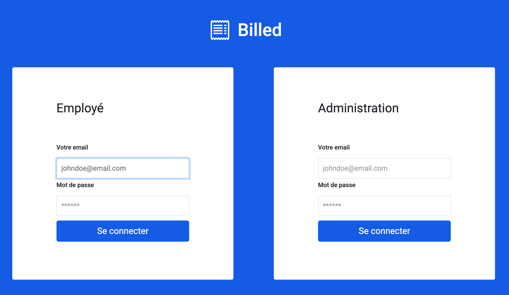

# P9-Billed-App
**Debug and test an HR SaaS**
<br/>
<br/>
<br/>
<br/>
<br/>
**Skills developed**:
- Write unit tests with JavaScript
- Debug a web application with the Chrome Debugger
- Write a manual end-to-end test plan
- Write integration tests with JavaScript
##
Preferably use Google Chrome to run the application
##
# Billapp Backend

================ FR ====================

## Comment lancer l'API en local:

### Cloner le projet:
```
git clone https://github.com/OpenClassrooms-Student-Center/Billed-app-FR-Back.git
```

### Acceder au repertoire du projet :
```
cd Billed-app-FR-Back
```

### Installer les dépendances du projet :

```
npm install
```

### 👉 Lancer l'API :

```
npm run run:dev
```

### Accéder à l'API :

L'api est accessible sur le port `5678` en local, c'est à dire `http://localhost:5678`

## 👉 Utilisateurs par défaut:

### administrateur : 
```
utilisateur : admin@test.tld 
mot de passe : admin
```
### employé :
```
utilisateur : employee@test.tld
mot de passe : employee
```


================ EN ====================


## How to run the API locally :


### Clone the projet:
```
git clone https://github.com/OpenClassrooms-Student-Center/Billed-app-FR-Back.git
```

### Go to the project directory :
```
cd Billed-app-FR-Back
```

### Install project dependancies :

```
npm install
```

### 👉 Run the API :

```
npm run:dev
```

### Access to the PAI :

The API is locally available on port `5678`, go to `http://localhost:5678`

### 👉 administrateur : 
```
utilisateur : admin@company.tld 
mot de passe : admin
```
### 👉 employé :
```
utilisateur : employee@company.tld
mot de passe : employee
```
# Billapp Front-End

================ FR ====================
## L'architecture du projet :
Ce projet, dit frontend, est connecté à un service API backend que vous devez aussi lancer en local.

Le projet backend se trouve ici: https://github.com/OpenClassrooms-Student-Center/Billed-app-FR-back

## Organiser son espace de travail :
Pour une bonne organization, vous pouvez créer un dossier bill-app dans lequel vous allez cloner le projet backend et par la suite, le projet frontend:

Clonez le projet backend dans le dossier bill-app :
```
$ git clone https://github.com/OpenClassrooms-Student-Center/Billed-app-FR-Back.git
```

```
bill-app/
   - Billed-app-FR-Back
```

Clonez le projet frontend dans le dossier bill-app :
```
$ git clone https://github.com/OpenClassrooms-Student-Center/Billed-app-FR-Front.git
```

```
bill-app/
   - Billed-app-FR-Back
   - Billed-app-FR-Front
```

## Comment lancer l'application en local ?

### étape 1 - Lancer le backend :

Suivez les indications dans le README du projet backend.

### étape 2 - Lancer le frontend :

Allez au repo cloné :
```
$ cd Billed-app-FR-Front
```

Installez les packages npm (décrits dans `package.json`) :
```
$ npm install
```

Installez live-server pour lancer un serveur local :
```
$ npm install -g live-server
```

Lancez l'application :
```
$ live-server
```

Puis allez à l'adresse : `http://127.0.0.1:8080/`


## 👉  Comment lancer tous les tests en local avec Jest ?

```
$ npm run test
```

## Comment lancer un seul test ?

Installez jest-cli :

```
$npm i -g jest-cli
$jest src/__tests__/your_test_file.js
```

## Comment voir la couverture de test ?

`http://127.0.0.1:8080/coverage/lcov-report/`

## Comptes et utilisateurs :

Vous pouvez vous connecter en utilisant les comptes:

### administrateur : 
```
utilisateur : admin@test.tld 
mot de passe : admin
```
### employé :
```
utilisateur : employee@test.tld
mot de passe : employee
```

### Overview login screen :
<br/>
